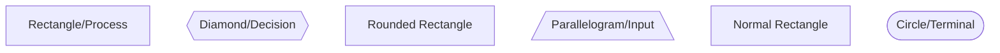
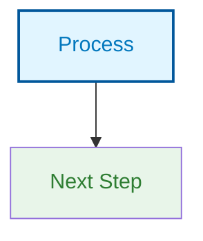
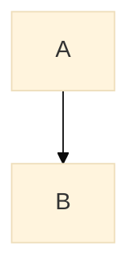

# Diagram Implementation Guide

This guide explains how to add and manage diagrams in the HSC Software Engineering notes.

## Quick Start

### Generate SVG from Mermaid Code

**Online (Easiest):**
1. Go to https://mermaid.live
2. Paste Mermaid code from `source-code/` directory
3. Click "Download" → "SVG"
4. Save to appropriate `generated/` folder

**Command Line:**
```bash
# Install Mermaid CLI (requires Node.js)
npm install -g @mermaid-js/mermaid-cli

# Generate SVG from .mmd file
mmdc -i sdlc-overview.mmd -o sdlc-overview.svg

# Generate with specific width/height
mmdc -i diagram.mmd -o diagram.svg -w 1024 -H 768

# Generate PNG instead
mmdc -i diagram.mmd -o diagram.png
```

## File Organization

```
diagrams/
├── source-code/          ← Mermaid .mmd files (editable source)
│   ├── flowcharts/       ← Process flows, SDLC, algorithms
│   ├── class-diagrams/   ← OOP class hierarchies
│   ├── data-models/      ← Entity relationships, databases
│   ├── network-diagrams/ ← Web architecture, protocols
│   ├── state-machines/   ← FSM, control flow
│   └── system-architecture/ ← Overall system design
│
├── generated/            ← SVG/PNG exports (linked from HTML)
│   └── [topic-name]/     ← One folder per topic page
│
└── templates/            ← Starter templates for students
    └── [topic-name]/
```

## Adding a Diagram to a Topic Page

### Step 1: Create or Find Mermaid Code

**Option A - Use existing diagram:**
- Browse `diagrams/source-code/`
- Find diagram in appropriate category
- Generate SVG from Mermaid code

**Option B - Create new diagram:**
- Copy template from `diagrams/templates/`
- Modify for your use case
- Validate at https://mermaid.live
- Save to `diagrams/source-code/[category]/`
- Generate SVG to `diagrams/generated/[topic]/`

### Step 2: Add CSS Styling

Add this to `css/styles.css`:

```css
/* ── Diagram Blocks ── */
.diagram-block {
  background: #f9f9f9;
  border-left: 4px solid var(--primary);
  padding: 1.5rem;
  margin: 2rem 0;
  border-radius: var(--radius-md);
  overflow-x: auto;
}

.diagram-block h4 {
  margin-top: 0;
  margin-bottom: 1rem;
  color: var(--primary);
  font-size: 1.1rem;
}

.diagram-figure {
  margin: 2rem 0;
  text-align: center;
}

.diagram-figure img {
  max-width: 100%;
  height: auto;
  border-radius: var(--radius-md);
  box-shadow: 0 2px 8px rgba(0,0,0,0.1);
}

.diagram-figure figcaption {
  font-size: 0.85rem;
  color: var(--text-secondary);
  margin-top: 0.5rem;
  font-style: italic;
}

.diagram-caption {
  font-size: 0.85rem;
  color: var(--text-secondary);
  margin-top: 1rem;
  padding-top: 1rem;
  border-top: 1px solid var(--border);
}

.diagram-caption strong {
  color: var(--text-primary);
  display: block;
  margin-bottom: 0.25rem;
}

/* Mermaid diagram styling */
.mermaid {
  display: flex;
  justify-content: center;
  background: white;
  padding: 1rem;
  border-radius: var(--radius-md);
  overflow-x: auto;
}

.mermaid svg {
  max-width: 100%;
  height: auto;
}
```

### Step 3: Add HTML to Topic Page

**Option A - Inline Mermaid (Dynamic):**
```html
<div class="diagram-block">
  <h4>📋 SDLC Flow Diagram</h4>
  <div class="mermaid">
    flowchart TD
        A["📋 Requirements"] --> B["⚙️ Design"]
        B --> C["💻 Development"]
        C --> D["🧪 Testing"]
        D --> E["📦 Deployment"]
  </div>
  <p class="diagram-caption">
    <strong>Purpose:</strong> Visualize the sequential flow of software development phases<br>
    <strong>Syllabus Link:</strong> SE-11-01<br>
    <strong>Try This:</strong> Map your project's phases onto this diagram
  </p>
</div>
```

**Option B - Embedded SVG Image (Static/Faster):**
```html
<figure class="diagram-figure">
  
  <figcaption>Software Development Life Cycle - Overview</figcaption>
</figure>
<p class="diagram-caption">
  <strong>Purpose:</strong> Visualize the sequential flow of software development phases<br>
  <strong>Syllabus Link:</strong> SE-11-01<br>
  <strong>Try This:</strong> Map your project's phases onto this diagram
</p>
```

### Step 4: Enable Mermaid in HTML (if using inline)

Add this to the bottom of any HTML page before closing `</body>`:

```html
<script src="https://cdn.jsdelivr.net/npm/mermaid/dist/mermaid.min.js"></script>
<script>
  mermaid.initialize({ startOnLoad: true, theme: 'default' });
  mermaid.contentLoaded();
</script>
```

## Diagram Types & Best Use Cases

### Flowcharts
- **Use for:** Processes, algorithms, decision flows, SDLC phases
- **Best for:** Sequential workflows, conditionals
- **Example:** SDLC flow, algorithm decision trees
- **File location:** `source-code/flowcharts/`

### Class Diagrams
- **Use for:** OOP hierarchies, inheritance, composition
- **Best for:** Object relationships, structure visualization
- **Example:** Vehicle hierarchy, Student management system
- **File location:** `source-code/class-diagrams/`

### Sequence Diagrams
- **Use for:** Message passing, interactions between objects
- **Best for:** Step-by-step interactions, request/response flows
- **Example:** Bank withdrawal, HTTP request flow
- **File location:** `source-code/flowcharts/` (or create `sequences/`)

### State Machine Diagrams
- **Use for:** State transitions, FSMs, control systems
- **Best for:** Systems with distinct states and transitions
- **Example:** Traffic light, authentication states
- **File location:** `source-code/state-machines/`

### Entity Relationship Diagrams
- **Use for:** Database design, data relationships
- **Best for:** Data structure visualization
- **Example:** Student, Course, Enrollment relationships
- **File location:** `source-code/data-models/`

## Mermaid Syntax Cheat Sheet

### Flowchart Shapes


### Colors & Styling


### Diagram Configuration


## Creating Diagram Descriptions

Each diagram should include:

1. **Title:** Clear, descriptive name
2. **Purpose:** What students should learn
3. **Syllabus Link:** Related outcome (e.g., SE-11-01)
4. **Scenario:** Real-world example or context
5. **Try This:** Suggested exercise for students

**Template:**
```html
<p class="diagram-caption">
  <strong>Purpose:</strong> [What this diagram teaches]<br>
  <strong>Syllabus Link:</strong> [SE-XX-XX outcome]<br>
  <strong>Scenario:</strong> [Real-world context]<br>
  <strong>Try This:</strong> [Suggested activity for students]
</p>
```

## Image Optimization

### SVG Files (Recommended)
- ✅ Scalable (no pixelation)
- ✅ Small file size
- ✅ Can be edited in text editor
- ✅ Works in all modern browsers

### PNG Files
- 📦 Use when SVG not supported
- 💾 Larger file size
- 🎨 Good for complex graphics
- 🚀 Faster rendering on mobile

**Generate PNG from Mermaid:**
```bash
mmdc -i diagram.mmd -o diagram.png
```

## Accessibility

All diagrams should include:

1. **Alt text** (for images):
   ```html
   
   ```

2. **Descriptive captions** explaining what the diagram shows

3. **Keyboard accessible** (if interactive)

4. **High contrast** colors for visibility

## Performance Tips

1. **Use SVG** for vector diagrams (smaller, scalable)
2. **Lazy load** large diagrams:
   ```html
   
   ```
3. **Embed small diagrams** inline with Mermaid
4. **Reference large diagrams** as external SVG files

## Collaboration & Version Control

1. **Store source code** in `source-code/` (always!)
2. **Use .mmd files** for Mermaid code (text-based, version control friendly)
3. **Generate SVGs** only when needed
4. **Commit both** source and generated files:
   ```bash
   git add diagrams/source-code/flowcharts/sdlc.mmd
   git add diagrams/generated/programming-fundamentals/sdlc.svg
   ```

## Troubleshooting

### Diagram doesn't render
- ✅ Check Mermaid syntax at https://mermaid.live
- ✅ Ensure script tag is present: `<script src="mermaid.min.js"></script>`
- ✅ Verify `mermaid.contentLoaded()` is called

### SVG not displaying
- ✅ Check file path is correct
- ✅ Verify SVG file exists in `diagrams/generated/`
- ✅ Check file permissions (readable)

### Diagram too large
- ✅ Reduce complexity (fewer nodes)
- ✅ Split into multiple smaller diagrams
- ✅ Use `width` and `height` in HTML: ``

## Next Steps

1. ✅ Determine which diagrams to add to each page (see README.md)
2. ✅ Generate SVG files from Mermaid code
3. ✅ Add diagrams to topic pages with proper captions
4. ✅ Style with CSS classes above
5. ✅ Test responsiveness on mobile devices
6. ✅ Get feedback from students on clarity

