# Diagram Integration Guide for HSC Software Engineering Notes

This guide identifies ideal locations to add diagrams and visual tools across all topic pages, with ready-to-use Mermaid code and implementation scenarios.

---

## Directory Structure

Create `/diagrams/` directory to organize all diagram assets:

```
diagrams/
├── README.md                          (this file)
├── generated/                         (SVG/PNG exports from Mermaid)
│   ├── programming-fundamentals/
│   ├── object-oriented-paradigm/
│   ├── secure-software-architecture/
│   ├── programming-for-the-web/
│   ├── software-automation/
│   └── programming-mechatronics/
├── source-code/                       (Mermaid/PlantUML source)
│   ├── flowcharts/
│   ├── class-diagrams/
│   ├── data-models/
│   ├── network-diagrams/
│   ├── state-machines/
│   └── system-architecture/
└── templates/                         (reusable diagram templates)
    ├── sdlc-template.mmd
    ├── flowchart-template.mmd
    ├── class-diagram-template.mmd
    └── sequence-diagram-template.mmd
```

---

## PROGRAMMING FUNDAMENTALS

### 1. SDLC Overview Diagram
**Location:** Section 1 - "🚀 Software Development Steps"

**Syllabus Link:** SE-11-01 (Explore the fundamental software development steps)

**Tool:** Flowchart / SDLC Diagram

**Purpose:** Visualize the sequential flow of SDLC phases and their interconnections

**Scenario:** A school attendance system project flows through: Requirements Definition → Specifications → Design → Development → Integration → Testing → Installation → Maintenance

**Mermaid Code:**
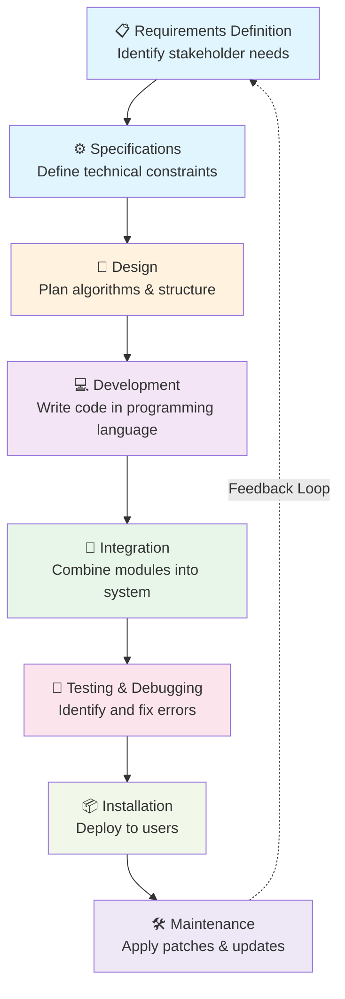

---

### 2. Algorithm Flowchart Examples
**Location:** Section 5 - "📝 Developing Algorithms Using Pseudocode and Flowcharts"

**Syllabus Link:** SE-11-02 (Develop structured algorithms)

**Tool:** Flowchart Diagram

**Purpose:** Show concrete examples of algorithm logic flow using standard flowchart symbols

**Scenario 1 - Linear Search:**
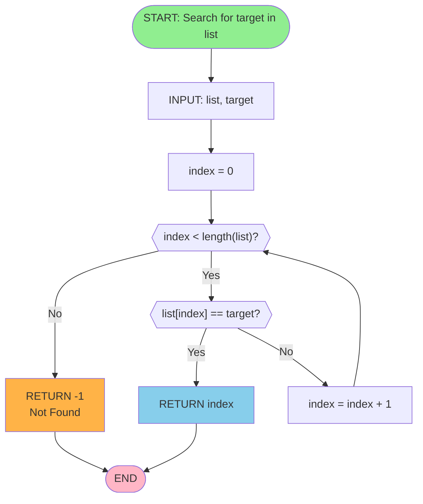

**Scenario 2 - Sorting Decision:**
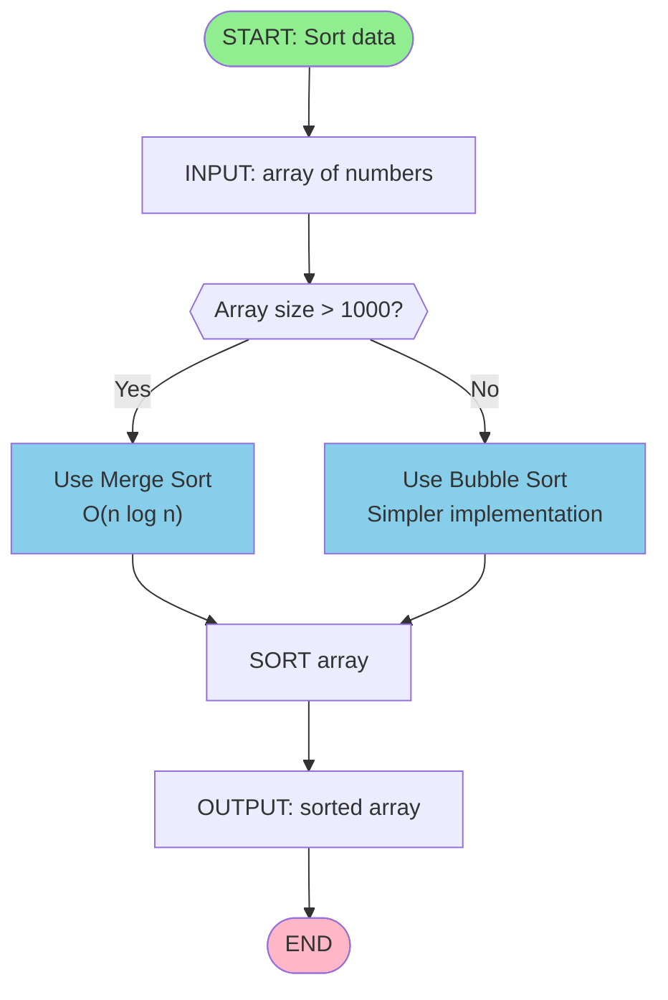

---

### 3. Structure Chart Diagram
**Location:** Section 6 - "📊 Modelling Tools for Design"

**Syllabus Link:** SE-11-02 (Use modelling tools)

**Tool:** Structure Chart / Hierarchical Diagram

**Purpose:** Show how a program breaks down into subroutines and how they call each other

**Scenario:** ATM system with modular structure

**Mermaid Code:**
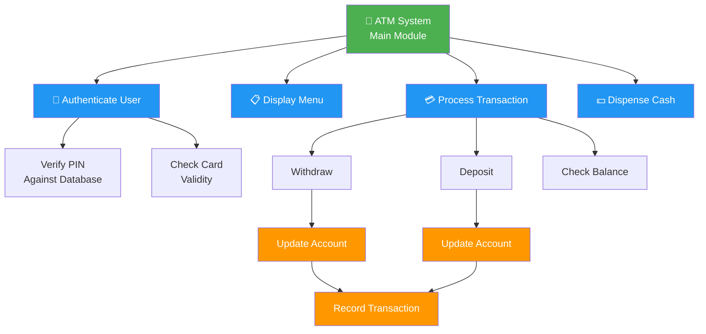

---

### 4. Data Dictionary Table
**Location:** Section 11 - "📋 Data Types and Data Dictionaries"

**Syllabus Link:** SE-11-04 (Investigate data structures)

**Tool:** Data Dictionary / Metadata Table

**Purpose:** Document all variables, their types, constraints, and purposes

**HTML Example:**
```html
<div class="code-block">
  <div class="code-header"><span class="code-lang">Data Dictionary — Student Management System</span></div>
  <table style="width:100%; border-collapse: collapse;">
    <tr style="background: #f0f0f0;">
      <th>Field Name</th>
      <th>Data Type</th>
      <th>Size</th>
      <th>Description</th>
      <th>Validation Rules</th>
    </tr>
    <tr>
      <td>Student_ID</td>
      <td>Integer</td>
      <td>5 digits</td>
      <td>Unique identifier for each student</td>
      <td>1000-99999, Cannot be NULL</td>
    </tr>
    <tr>
      <td>First_Name</td>
      <td>String</td>
      <td>Max 50 chars</td>
      <td>Student's first name</td>
      <td>Letters only, Cannot be NULL</td>
    </tr>
    <tr>
      <td>Email</td>
      <td>String</td>
      <td>Max 100 chars</td>
      <td>Student email address</td>
      <td>Must match email format</td>
    </tr>
    <tr>
      <td>Grade_Level</td>
      <td>Integer</td>
      <td>2 digits</td>
      <td>Current year level (11 or 12)</td>
      <td>Must be 11 or 12</td>
    </tr>
    <tr>
      <td>Enrollment_Date</td>
      <td>Date</td>
      <td>YYYY-MM-DD</td>
      <td>When student enrolled</td>
      <td>Cannot be in future</td>
    </tr>
  </table>
</div>
```

---

### 5. Algorithm Complexity Analysis Diagram
**Location:** Section 7 - "🔍 Analysing Algorithm Logic and Structure"

**Syllabus Link:** SE-11-02 (Apply computational thinking)

**Tool:** Time Complexity Visualization (Big O Notation)

**Purpose:** Visualize how algorithm performance scales with input size

**Mermaid Code:**
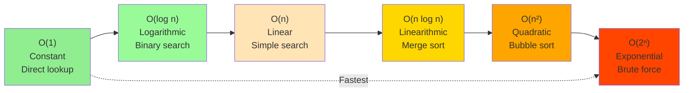

---

## OBJECT-ORIENTED PARADIGM

### 1. Class Diagram Example
**Location:** Section 4 - "🧱 Apply: The Four Pillars of OOP"

**Syllabus Link:** SE-11-08, SE-11-09 (Programming in OOP)

**Tool:** UML Class Diagram

**Purpose:** Show how classes encapsulate properties and methods, demonstrating inheritance and composition

**Scenario:** Vehicle management system with inheritance hierarchy

**Mermaid Code:**
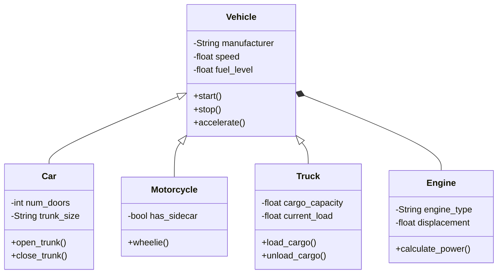

---

### 2. OOP Paradigm Comparison
**Location:** Section 2 - "⚡ Comparing Procedural and Object-Oriented Programming"

**Syllabus Link:** SE-11-07 (Understanding OOP concepts)

**Tool:** Venn Diagram / Comparison Chart

**Mermaid Code:**
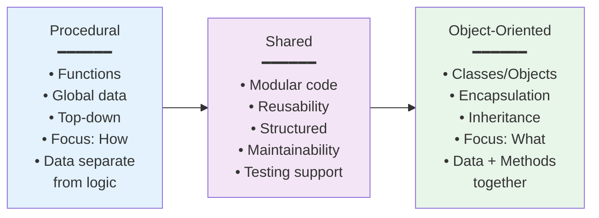

---

### 3. Message Passing / Sequence Diagram
**Location:** Section 7 - "📨 Message-Passing Between Objects"

**Syllabus Link:** SE-11-09 (Programming in OOP)

**Tool:** UML Sequence Diagram

**Purpose:** Show how objects communicate through method calls in a specific scenario

**Scenario:** Bank system - withdrawing money

**Mermaid Code:**
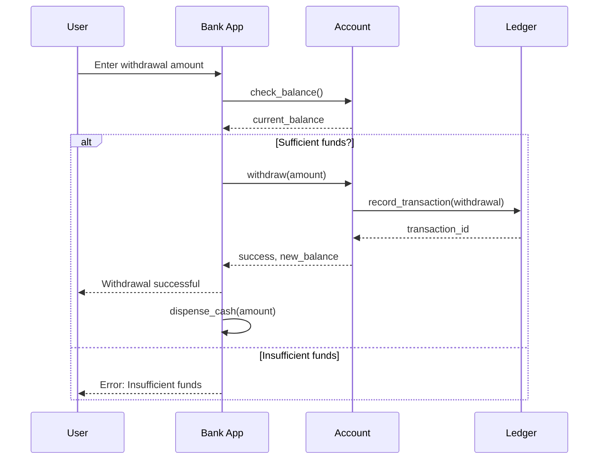

---

## SECURE SOFTWARE ARCHITECTURE

### 1. Secure SDLC Flowchart
**Location:** Section 2 - "🔄 Applying the SDLC to Develop Secure Code"

**Syllabus Link:** SE-12-06 (Develop secure software)

**Tool:** Enhanced SDLC Flowchart with Security Checkpoints

**Purpose:** Show security gates and validation points throughout development

**Mermaid Code:**
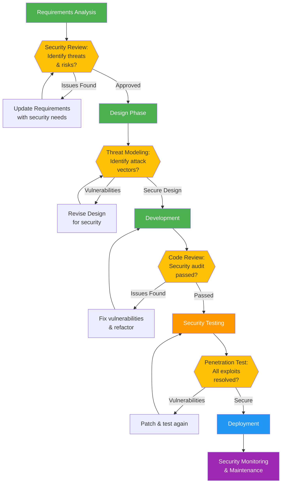

---

### 2. Threat Model Diagram
**Location:** Section 3 - "🏗️ Security by Design: Cryptography and Sandboxing"

**Syllabus Link:** SE-12-07 (Design secure systems)

**Tool:** Data Flow Diagram (DFD) with Threat Indicators

**Purpose:** Identify where data is vulnerable and what protections are needed

**Scenario:** Web application threat model

**Mermaid Code:**
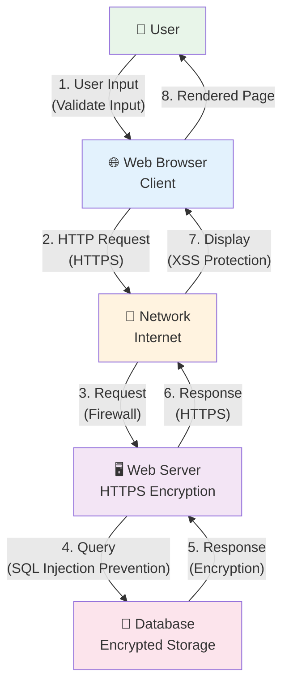

---

### 3. Security Testing Matrix
**Location:** Section 3 - "🧪 Security Testing and Management Strategies"

**Syllabus Link:** SE-12-11 (Testing security)

**Tool:** Testing Checklist / Matrix

**HTML Example:**
```html
<div class="code-block">
  <div class="code-header"><span class="code-lang">Security Testing Checklist</span></div>
  <table style="width:100%; border-collapse: collapse;">
    <tr style="background: #f0f0f0;">
      <th>Test Category</th>
      <th>Test Type</th>
      <th>Example</th>
      <th>Tools</th>
    </tr>
    <tr>
      <td><strong>Input Validation</strong></td>
      <td>Fuzzing</td>
      <td>Test with unexpected inputs: '; DROP TABLE--</td>
      <td>Burp Suite, OWASP ZAP</td>
    </tr>
    <tr>
      <td><strong>Authentication</strong></td>
      <td>Brute Force</td>
      <td>Test password strength, session management</td>
      <td>Hashcat, John the Ripper</td>
    </tr>
    <tr>
      <td><strong>Authorization</strong></td>
      <td>Privilege Escalation</td>
      <td>Test if users can access unauthorized data</td>
      <td>Manual testing, automated scanners</td>
    </tr>
    <tr>
      <td><strong>Cryptography</strong></td>
      <td>Weak Encryption</td>
      <td>Test SSL/TLS configuration</td>
      <td>SSL Labs, TestSSL</td>
    </tr>
    <tr>
      <td><strong>Business Logic</strong></td>
      <td>Logic Flaws</td>
      <td>Test transaction flow exploits</td>
      <td>Manual code review, SAST tools</td>
    </tr>
  </table>
</div>
```

---

## PROGRAMMING FOR THE WEB

### 1. Web Data Flow / Request-Response Diagram
**Location:** Section 2 - "📦 Data Transfer on the Internet"

**Syllabus Link:** SE-12-02 (Understand web technologies)

**Tool:** Sequence Diagram / Architecture Diagram

**Purpose:** Show how HTTP requests and responses flow between client and server

**Mermaid Code:**
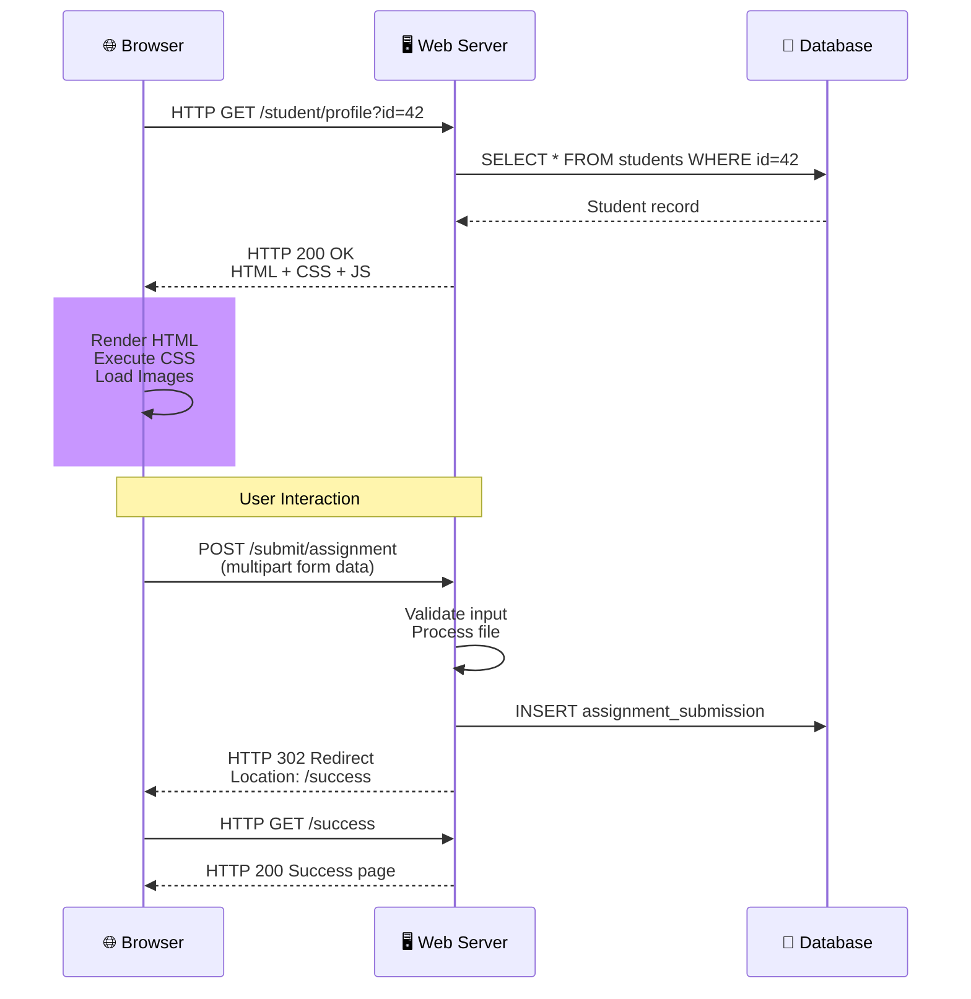

---

### 2. Web Protocol Stack Diagram
**Location:** Section 3 - "🔌 Web Protocols and Their Ports"

**Syllabus Link:** SE-12-02 (Understand protocols)

**Tool:** Layered Architecture / OSI Model

**Purpose:** Show how web protocols stack on top of each other

**Mermaid Code:**
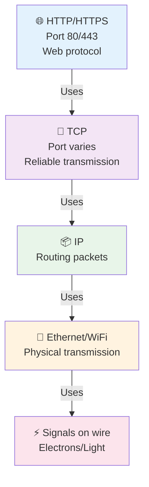

---

### 3. Web Architecture Diagram
**Location:** Section 7 - "🏗️ Modelling a Web Development System"

**Syllabus Link:** SE-12-04 (Model web systems)

**Tool:** System Architecture Diagram

**Purpose:** Show the overall structure of a modern web application

**Mermaid Code:**
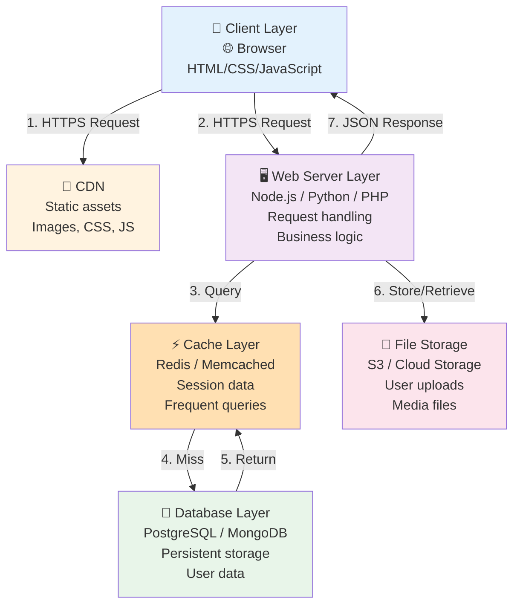

---

## SOFTWARE AUTOMATION / MACHINE LEARNING

### 1. Decision Tree Diagram
**Location:** Section 1 - "🌳 Design Models for ML: Decision Trees & Neural Networks"

**Syllabus Link:** SE-12-14 (Develop ML models)

**Tool:** Decision Tree / Flowchart

**Purpose:** Show how decision trees make predictions through a series of decisions

**Scenario:** Email spam classification

**Mermaid Code:**
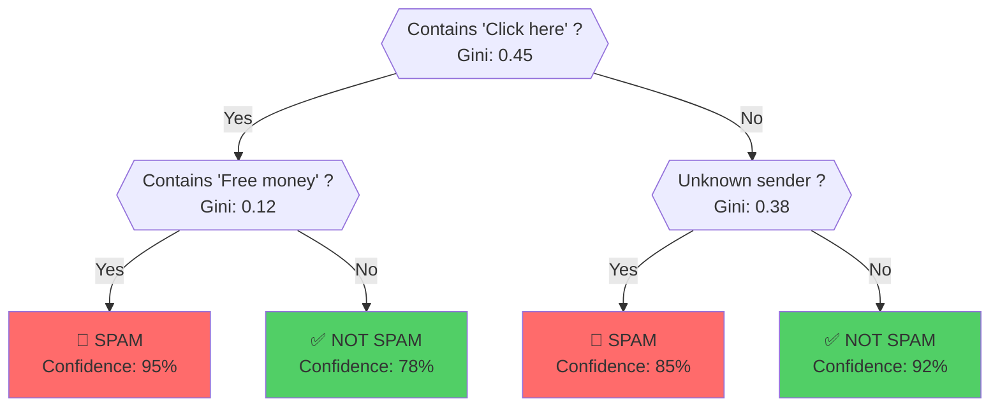

---

### 2. Neural Network Topology Diagram
**Location:** Section 2 - "🕸️ Neural Network Models Using OOP"

**Syllabus Link:** SE-12-14 (Implement ML algorithms)

**Tool:** Neural Network Architecture Diagram

**Purpose:** Visualize the structure of a neural network with layers and connections

**Mermaid Code:**
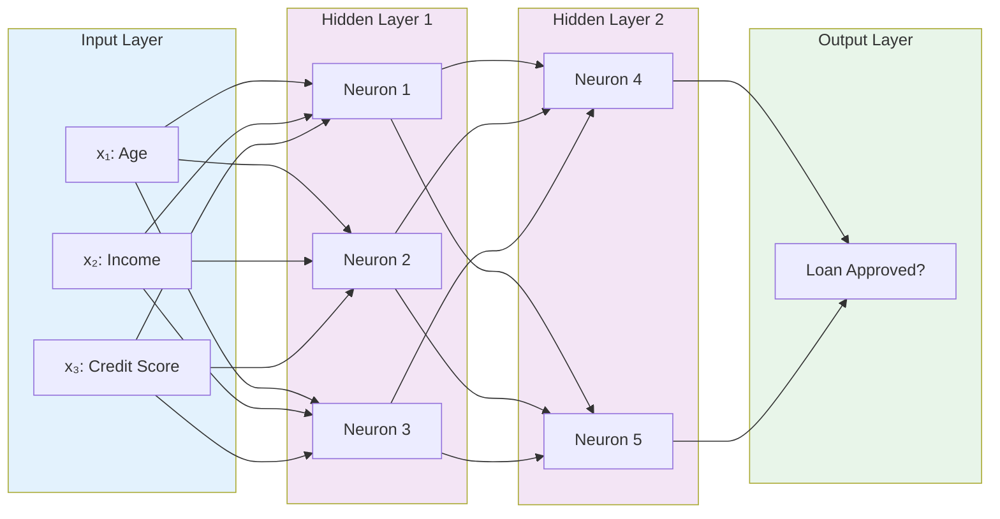

---

## PROGRAMMING MECHATRONICS

### 1. Mechatronic System Block Diagram
**Location:** Section 1 - "🦾 Mechatronic Applications"

**Syllabus Link:** SE-11-12 (Understand mechatronics)

**Tool:** Block Diagram / System Architecture

**Purpose:** Show the interaction between software, hardware, sensors, and actuators

**Scenario:** Autonomous mobile robot

**Mermaid Code:**
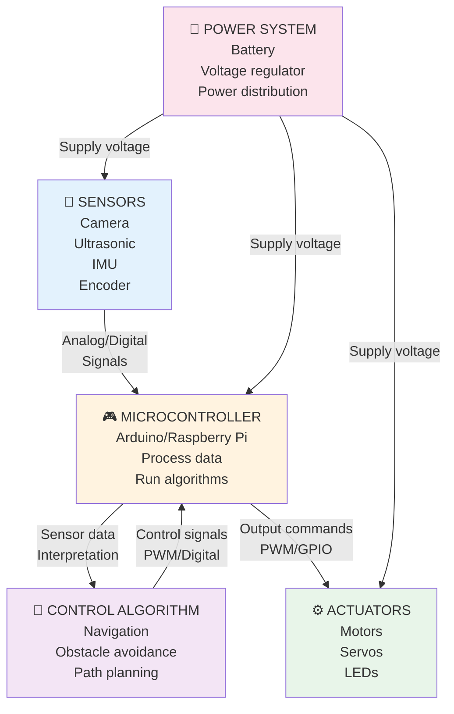

---

### 2. Sensor/Actuator Interaction Diagram
**Location:** Section 3 - "🌡️ Sensors, Actuators & Manipulators"

**Syllabus Link:** SE-11-13 (Select and use components)

**Tool:** Component Relationship Diagram

**Purpose:** Show how different sensors and actuators work together in a system

**Scenario:** Climate control system

**Mermaid Code:**
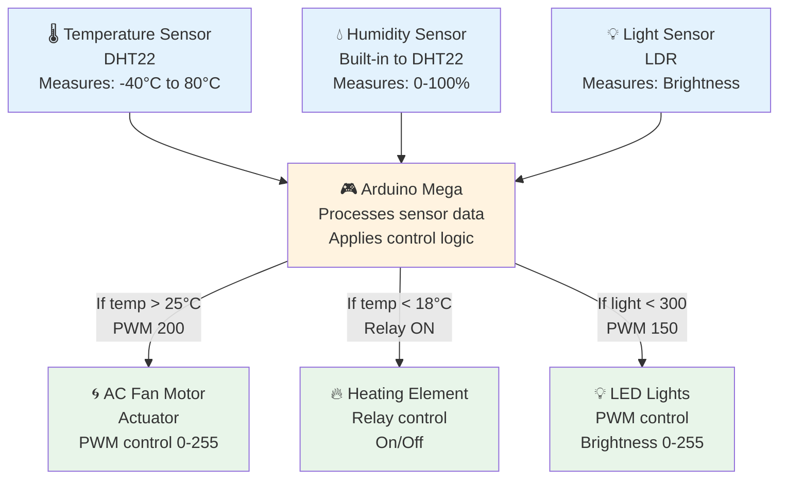

---

### 3. Control Algorithm State Machine
**Location:** Section 4 - "🧠 Algorithm Development and Control Systems"

**Syllabus Link:** SE-11-14 (Develop control algorithms)

**Tool:** State Machine Diagram / FSM

**Purpose:** Show how a system transitions between different states based on inputs

**Scenario:** Traffic light control system

**Mermaid Code:**
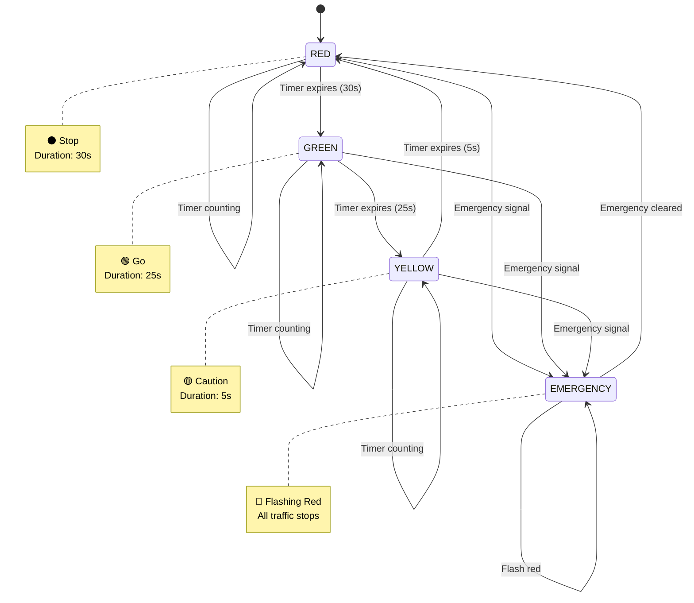

---

### 4. Wiring Diagram Reference
**Location:** Section 5 - "🔌 Power, Materials and Wiring Diagrams"

**Syllabus Link:** SE-11-13 (Build mechatronic systems)

**Tool:** Circuit Diagram

**Purpose:** Show electrical connections, components, and power distribution

**Simple Motor Control Example:**
```
    +5V ─────────┬─────────┐
                 │         │
                 R1       [==] Motor
                 │         │
                 └─────┬───┘
                       │
                      LED (indicator)
                       │
               [Switch] S1
                       │
                      GND
```

---

## IMPLEMENTATION GUIDELINES

### Adding Diagrams to HTML Pages

**Option 1: Embed Mermaid directly in HTML**
```html
<div class="diagram-block">
  <h3>Diagram Title</h3>
  <div class="mermaid">
    [Mermaid code here]
  </div>
  <p class="diagram-caption">
    <strong>Purpose:</strong> [Explain what students should learn]<br>
    <strong>Try This:</strong> [Suggested exercise or analysis]
  </p>
</div>
```

**Option 2: Reference external SVG**
```html
<figure class="diagram-figure">
  
  <figcaption>SDLC Overview with security checkpoints</figcaption>
</figure>
```

### CSS for Diagrams
```css
.diagram-block {
  background: #f9f9f9;
  border-left: 4px solid var(--primary);
  padding: 1.5rem;
  margin: 2rem 0;
  border-radius: var(--radius-md);
}

.diagram-block h3 {
  margin-top: 0;
  color: var(--primary);
}

.mermaid {
  display: flex;
  justify-content: center;
  margin: 1rem 0;
}

.diagram-caption {
  font-size: 0.85rem;
  color: var(--text-secondary);
  margin-top: 1rem;
  padding-top: 1rem;
  border-top: 1px solid var(--border);
}
```

---

## Next Steps

1. **Create `/diagrams/` directory structure** using the layout above
2. **Generate SVG files** from Mermaid code using:
   - Mermaid CLI: `mmdc -i source.mmd -o output.svg`
   - Online editor: https://mermaid.live
3. **Add diagrams to pages** using the HTML implementation guidelines
4. **Update styles.css** with diagram styling from above
5. **Create diagram legend** for each page explaining symbols used
6. **Add interactive elements** (tooltips, expand/collapse) for complex diagrams

---

## Diagram Legend

- **Rectangles/Boxes**: Processes, components, or systems
- **Diamonds**: Decision points / Conditions
- **Arrows**: Flow direction, data transfer, relationships
- **Cylinders**: Databases or storage
- **Circles**: Start/end points
- **Dotted lines**: Feedback loops or optional paths
- **Color coding**:
  - 🟦 Blue: Input/Start
  - 🟪 Purple: Processing/Logic
  - 🟩 Green: Output/Result
  - 🟧 Orange: Warning/Caution
  - 🟥 Red: Error/Stop

